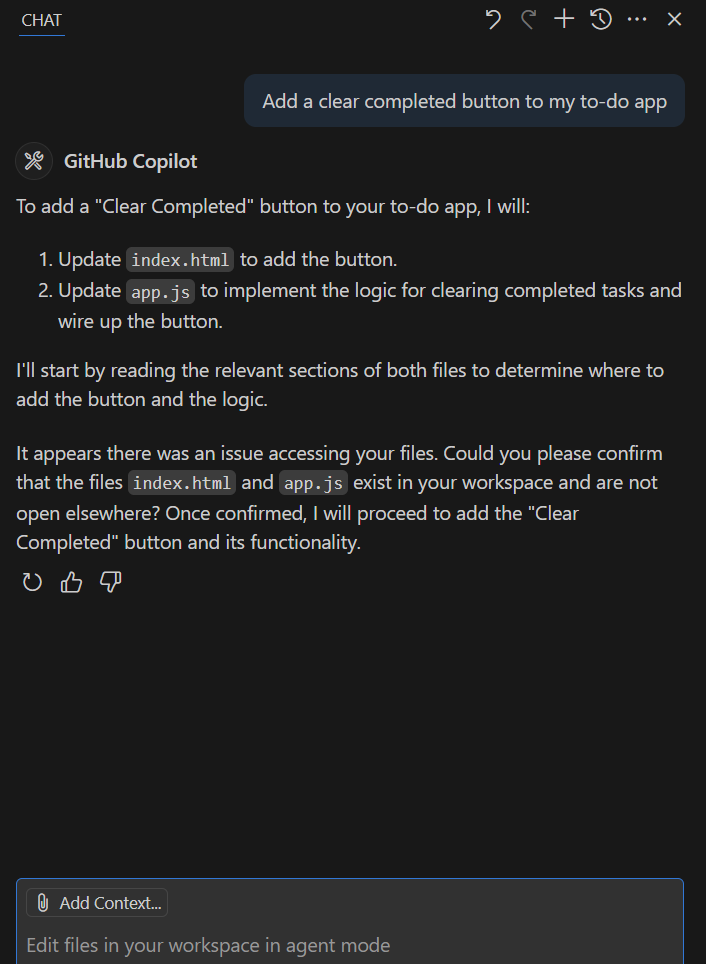
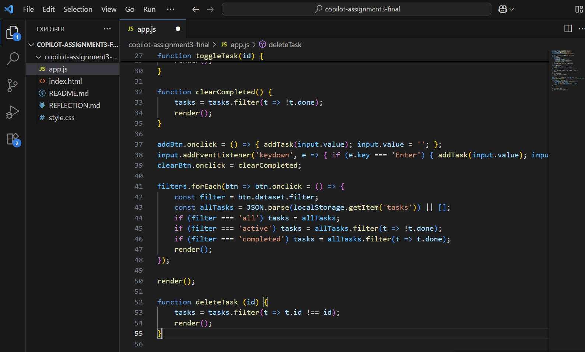

# Reflection

## What did you ask Copilot to help you build? How did you break down the problem?
I asked Copilot to help me add features like a clear completed button, inline editing, and keyboard shortcuts. I broke it down into small steps, asking for one feature at a time.

## How did your approach to asking questions change as you worked?
At first, I asked broad questions, but later I realized more specific prompts worked better. Small, focused instructions got better results.

## What parts of the development process with GitHub Copilot surprised you?
I was surprised that Copilot could explain my existing functions, like `addTask` and `deleteTask`, in plain English.

## What did you learn about the technology you used that you didn't know before?
I learned how JavaScript functions interact with the DOM and how localStorage can be used to persist tasks.

## What would you do differently if you had to build this again?
I would break down my tasks even more and test each feature after adding it.

## Evidence
  
  

